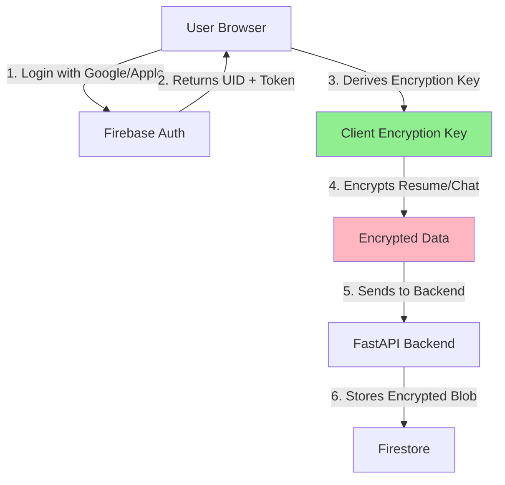

# 🔐 AppSageAI Privacy Architecture

## Overview
AppSageAI implements a **zero-knowledge architecture** where even the application developers cannot read user's sensitive data.

## Data Flow



## What Gets Encrypted

### 🔒 **Fully Encrypted** (You CANNOT see):
- Resume content
- Chat messages
- User responses
- Analysis results
- Personal information in memories

### 📊 **Metadata Only** (You CAN see):
- Timestamps
- Document IDs (random UUIDs)
- Token counts
- Response times
- Error logs (sanitized)

## Encryption Implementation

### Client-Side (Browser)
```javascript
// Encryption happens BEFORE sending to backend
const encryptedData = await encryptClientSide(resumeContent, userKey);
// Backend receives only encrypted blob
```

### What Backend Sees
```json
{
  "userId": "hashed_uid_xxx",
  "timestamp": "2024-01-15T10:30:00Z",
  "encryptedContent": "U2FsdGVkX1+vupppZksvRf5pq5g5...", // Meaningless without key
  "metadata": {
    "tokens": 1500,
    "model": "llama-3.3-70b",
    "responseTime": 2341
  }
}
```

## Firestore Structure

```
users/
  {userId}/                     # Firebase UID
    profile/
      email: "hashed_email"     # Hashed for privacy
      createdAt: timestamp
      plan: "free"
    
    chats/
      {chatId}/
        encryptedMessages: "..." # Client-encrypted
        timestamp: timestamp
        metadata: {}
    
    resumes/
      {resumeId}/
        encryptedContent: "..."  # Client-encrypted
        uploadedAt: timestamp
        filename: "resume.pdf"   # Can be encrypted too
    
    memories/
      {memoryId}/
        encryptedMemory: "..."   # Client-encrypted
        type: "skill"
        createdAt: timestamp

analytics/                       # Backend-only access
  {sessionId}/
    userId: "hashed_uid"        # Hashed
    action: "resume_analysis"
    timestamp: timestamp
    metrics: {}                 # No PII
```

## Security Measures

### 1. **Key Derivation**
```javascript
// Client-side key derivation
const deriveKey = async (firebaseUid, userPin) => {
  const keyMaterial = firebaseUid + userPin; // Optional PIN for extra security
  const key = await pbkdf2(keyMaterial, salt, 100000, 256);
  return key;
};
```

### 2. **Encryption Algorithm**
- **Algorithm**: AES-256-GCM
- **Key Derivation**: PBKDF2 with 100,000 iterations
- **Implementation**: Web Crypto API (browser native)

### 3. **Backend Security**
- Backend NEVER receives encryption keys
- All encryption/decryption is client-side
- Backend only stores and retrieves encrypted blobs

### 4. **Optional PIN Protection**
Users can add a PIN for extra security:
- PIN is never sent to server
- Used in key derivation
- Forgotten PIN = data loss (true zero-knowledge)

## Privacy Guarantees

### ✅ **What We Guarantee**
1. **Zero-Knowledge**: We cannot read your encrypted data
2. **No Backdoors**: No master key exists
3. **Open Source**: All encryption code is auditable
4. **Client Control**: Keys exist only in your browser
5. **Data Portability**: Export your encrypted data anytime

### ⚠️ **Trade-offs**
1. **Lost Keys**: If you forget your PIN, data is unrecoverable
2. **No Server-Side Search**: Can't search encrypted content
3. **Limited Sharing**: Can't easily share between devices
4. **Performance**: Client-side encryption adds latency

## Compliance

### GDPR Compliance
- ✅ Right to erasure (delete all encrypted blobs)
- ✅ Data portability (export encrypted data)
- ✅ Privacy by design
- ✅ Data minimization

### CCPA Compliance
- ✅ User can request data deletion
- ✅ User can opt-out of analytics
- ✅ Clear privacy policy

## Audit Trail

All data access is logged (without PII):
```json
{
  "timestamp": "2024-01-15T10:30:00Z",
  "action": "data_access",
  "userHash": "sha256_hash_of_uid",
  "resource": "chats",
  "result": "success"
}
```

## Emergency Scenarios

### User Locked Out
- **With PIN**: Cannot recover data (true zero-knowledge)
- **Without PIN**: Can regenerate key from Firebase UID
- **Recommendation**: Optional recovery questions (encrypted)

### Data Breach
- Encrypted data is useless without keys
- Keys are never stored server-side
- Each user has unique encryption key

## Implementation Checklist

- [ ] Client-side encryption library (Web Crypto API)
- [ ] Key derivation from Firebase UID
- [ ] Optional PIN support
- [ ] Encrypted blob storage in Firestore
- [ ] Metadata separation from content
- [ ] Analytics without PII
- [ ] Security rules in Firestore
- [ ] Audit logging
- [ ] Privacy policy page
- [ ] Data export functionality