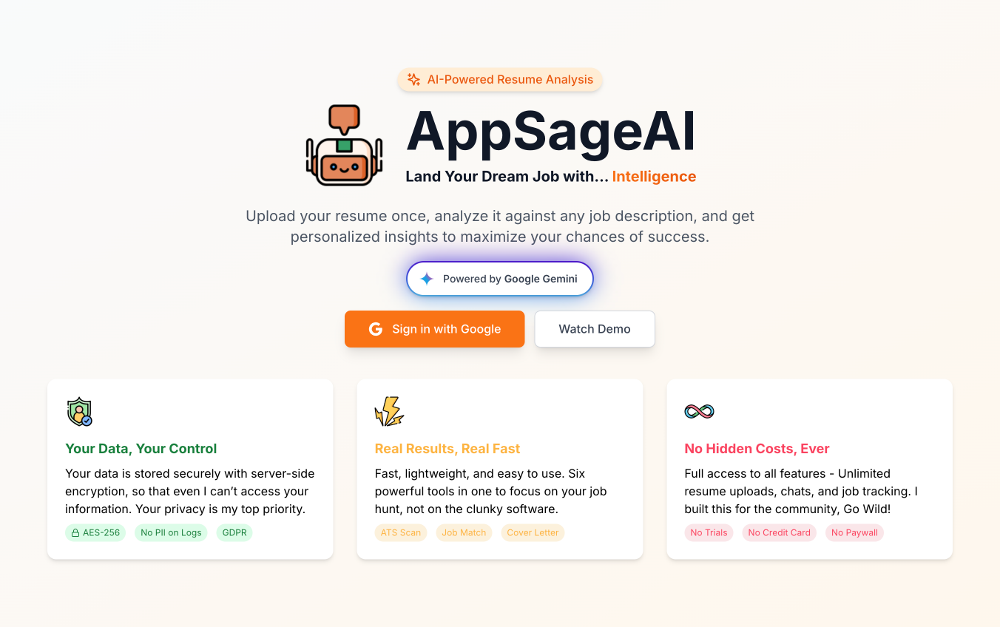
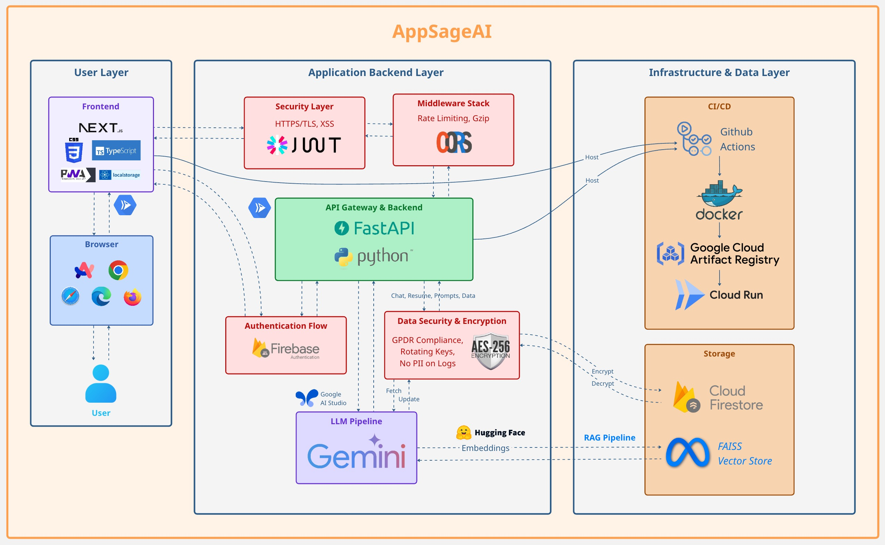

# AppSageAI - Privacy-First AI Resume Analyzer

Transform your job search with intelligent resume analysis while keeping your data completely private.

Checkout the Application here: [appsageai.com](https://appsageai-frontend-964026407675.us-central1.run.app)

Watch the demo video here: [](https://drive.google.com/file/d/1yjaVjYMUkm0EyKPY1trS6bXLOjmPu7qa/view?usp=sharing)

## What is AppSageAI?

AppSageAI is a privacy-focused job application companion that uses advanced AI to analyze your resume against job descriptions. Unlike other tools, we prioritize your data privacy with enterprise-grade encryption, ensuring your personal information remains secure.

## 🔐 Privacy-First Architecture

### Your Data, Your Control
- **AES-256 Encryption**: All resumes, chats, prompts, and personal data encrypted at rest
- **Anonymized Analytics**: No personally identifiable information in logs
- **Secure Infrastructure**: Hosted on Google Cloud with enterprise security
- **GDPR Compliant**: Full data portability and right to deletion

### Security Features
- **End-to-End Encryption**: All sensitive data encrypted before storage
- **Zero-Knowledge**: Even developers cannot access your encrypted data
- **Secure Authentication**: Firebase Auth with OAuth 2.0
- **Rate Limiting**: Protection against abuse
- **CORS Protection**: Restricted API access
- **Input Sanitization**: XSS and injection prevention

## ✨ Key Features

### Intelligent Analysis
- **Job Match Analysis**: Comprehensive review against requirements
- **ATS Optimization**: Keyword analysis for applicant tracking systems
- **Match Scoring**: Percentage-based compatibility assessment
- **Skill Gap Analysis**: Personalized improvement roadmap
- **Cover Letter Generation**: Tailored letters for each application

### Application Management
- **Multi-Resume Support**: Upload different versions for different roles
- **Job Tracker**: Track application status (Applied, Interviewing, Offered)
- **Chat History**: Maintain context across multiple applications
- **Custom Prompts**: Personalize AI responses to your industry

### Modern User Experience
- **Real-time Streaming**: Instant AI responses as they generate
- **Smart Resume Tagging**: Reference specific resumes with @mentions
- **Markdown Support**: Rich text formatting in responses
- **Mobile Responsive**: Full functionality on any device

### Usage Limits (100% Free Forever)
- Unlimited resume uploads
- Unlimited chat sessions
- Rate Limit: 100 analyses per minute per user
- All features included
- No credit card required

## Project Architecture


## Technology Stack

### Frontend
- **Framework**: Next.js 14 with TypeScript
- **Authentication**: Firebase Auth (Google OAuth)
- **Styling**: Tailwind CSS with custom Claude-inspired design
- **State Management**: React Context API
- **Real-time**: Server-Sent Events (SSE) for streaming

### Backend
- **Framework**: FastAPI (Python 3.12)
- **AI Models**: 
  - Google Gemini 2.5 Flash (Analysis)
  - HuggingFace Embeddings (RAG)
- **Database**: Google Firestore
- **Security**: AES-256 Fernet Encryption
- **Vector Store**: FAISS for semantic search

### Infrastructure
- **Hosting**: Google Cloud Run (Serverless)
- **CI/CD**: GitHub Actions
- **Container**: Docker with Artifact Registry
- **Monitoring**: Cloud Run health checks

## 📁 Project Structure
```
appsageai/
├── frontend/             # Next.js application
├── backend/              # FastAPI application
├── docs/                 # Readme Files for the repo
└── .github/workflows/     # CI/CD pipelines
```

## Getting Started - Guide
To start working with the `AppSageAI` project, please follow the setup instructions outlined in the [Backend Setup Guide](./backend/README.md), [Frontend Setup Guide](./frontend/README.md), and in [Cloud Setup Guide](./docs/SETUP.md)

This guide includes steps for creating a GCP account, configuring environment variables, setting up GitHub secrets, deploying locally, and hosting the Chatbot API. Once the initial setup is complete, you can explore the following detailed guides for specific aspects of the project:
- [Understand the API Payloads](./docs/API_DOCUMENTATION.md)
- [CI/CD Workflow](./docs/CICD_WORKFLOW.md)
- [Contributing Authors](./docs/AUTHORS.md)
- [Understand how Privacy works](./docs/PRIVACY_ARCHITECTURE.md)

## Contributing
We welcome contributions! Please see our [Contributing Guide](./docs/CONTRIBUTING.md) for details.

## License
This project is licensed under the MIT License - see the LICENSE file for details.

## 🙏 Acknowledgments
- Powered by Google Gemini AI
- Built with privacy as the foundation
- Inspired by the need for secure job application tools

## Contact
For questions or support, please open an issue on GitHub.
