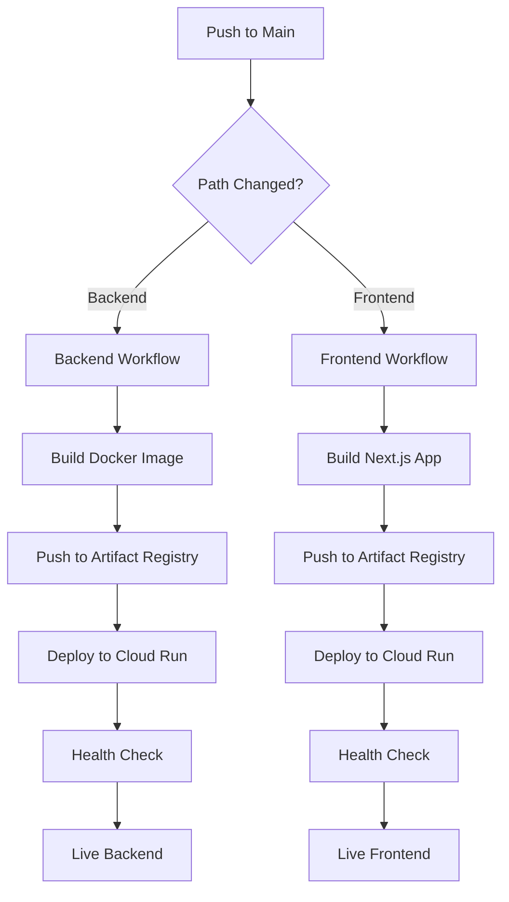

# AppSageAI CI/CD Deployment Workflow

Complete guide for setting up automated deployment pipelines using GitHub Actions and Google Cloud Run.

## Prerequisites

- GitHub repository with your code
- Google Cloud Project with billing enabled
- Docker installed locally (for testing)
- gcloud CLI configured
- Firebase project initialized

## Understanding the Docker Architecture

### Backend Dockerfile Explained

```dockerfile
FROM python:3.12-slim
```
- Uses official Python 3.12 slim image for minimal size
- Slim variant reduces image size from ~1GB to ~150MB

```dockerfile
RUN apt-get update && apt-get install -y \
    gcc g++ curl ca-certificates \
    && rm -rf /var/lib/apt/lists/*
```
- Installs build essentials for Python packages
- Cleans up apt cache to reduce image size

```dockerfile
RUN curl -LsSf https://astral.sh/uv/install.sh | sh
ENV PATH="/root/.local/bin:$PATH"
```
- Installs UV package manager for faster Python dependency management
- UV is 10-100x faster than pip for dependency resolution

```dockerfile
COPY pyproject.toml .
RUN uv pip install -r pyproject.toml --system
```
- Copies dependency file first (Docker layer caching)
- Installs dependencies before copying code for better caching

```dockerfile
HEALTHCHECK --interval=30s --timeout=3s --start-period=5s --retries=3 \
  CMD python -c "import requests; requests.get('http://localhost:8000/health')" || exit 1
```
- Health check ensures container is running properly
- Cloud Run uses this to determine instance health

### Frontend Dockerfile Explained

```dockerfile
FROM node:18-alpine
```
- Alpine Linux for minimal image size (~50MB base)
- Node 18 LTS for stability

```dockerfile
# Build arguments for environment variables
ARG NEXT_PUBLIC_FIREBASE_API_KEY
# ... other args
ENV NEXT_PUBLIC_FIREBASE_API_KEY=$NEXT_PUBLIC_FIREBASE_API_KEY
```
- Build-time arguments passed during `docker build`
- Next.js requires `NEXT_PUBLIC_` prefix for client-side env vars
- Variables are baked into the build at compile time

```dockerfile
RUN npm run build
```
- Creates optimized production build
- Static pages pre-rendered where possible
- JavaScript bundled and minified

```dockerfile
RUN addgroup -g 1001 -S nodejs && \
    adduser -S nextjs -u 1001
USER nextjs
```
- Security: Run as non-root user
- Prevents container privilege escalation

## GitHub Actions Setup

### Understanding the Workflow Files

#### Workflow Triggers
```yaml
on:
  push:
    branches: [main]
    paths:
      - 'backend/**'
      - '.github/workflows/deploy-backend.yml'
  workflow_dispatch:
```
- **push to main**: Automatic deployment on merge
- **paths filter**: Only deploy when relevant files change
- **workflow_dispatch**: Manual trigger from GitHub UI

#### Authentication Step
```yaml
- name: Authenticate to Google Cloud
  uses: google-github-actions/auth@v1
  with:
    credentials_json: ${{ secrets.GCP_SA_KEY }}
```
- Uses service account JSON for authentication
- Service account needs specific IAM roles

#### Docker Build & Push
```yaml
- name: Build Docker image
  run: |
    docker build -t "us-central1-docker.pkg.dev/$PROJECT_ID/$SERVICE/$SERVICE:$GITHUB_SHA" \
      --build-arg NEXT_PUBLIC_FIREBASE_API_KEY=${{ secrets.FIREBASE_API_KEY }} \
      ./frontend
```
- Tags with commit SHA for versioning
- Build args inject secrets at build time
- Image pushed to Google Artifact Registry

#### Cloud Run Deployment
```yaml
- name: Deploy to Cloud Run
  run: |
    gcloud run deploy $SERVICE_NAME \
      --image $IMAGE_URL \
      --region us-central1 \
      --memory=8Gi \
      --cpu=4 \
      --timeout=240 \
      --max-instances=10
```
- Deploys containerized application
- Auto-scaling from 0 to 10 instances
- Generous timeout for AI processing

## Setting Up GitHub Secrets

### Step 1: Create Service Account

```bash
# Create service account
gcloud iam service-accounts create github-actions \
  --display-name="GitHub Actions Deploy"

# Grant necessary roles
PROJECT_ID=appsageai-472321

gcloud projects add-iam-policy-binding $PROJECT_ID \
  --member="serviceAccount:github-actions@$PROJECT_ID.iam.gserviceaccount.com" \
  --role="roles/run.admin"

gcloud projects add-iam-policy-binding $PROJECT_ID \
  --member="serviceAccount:github-actions@$PROJECT_ID.iam.gserviceaccount.com" \
  --role="roles/artifactregistry.writer"

gcloud projects add-iam-policy-binding $PROJECT_ID \
  --member="serviceAccount:github-actions@$PROJECT_ID.iam.gserviceaccount.com" \
  --role="roles/iam.serviceAccountUser"

# Download key
gcloud iam service-accounts keys create github-sa-key.json \
  --iam-account=github-actions@$PROJECT_ID.iam.gserviceaccount.com
```

### Step 2: Add Secrets to GitHub

Navigate to: **Repository → Settings → Secrets and variables → Actions**

#### Required Secrets

| Secret Name | Description | Where to Find |
|------------|-------------|---------------|
| **GCP_SA_KEY** | Service account JSON | Contents of `github-sa-key.json` |
| **GCP_PROJECT_ID** | Google Cloud project ID | `appsageai-472321` or your project |
| **FIREBASE_API_KEY** | Firebase Web API Key | Firebase Console → Project Settings |
| **FIREBASE_AUTH_DOMAIN** | Auth domain | `your-project.firebaseapp.com` |
| **FIREBASE_PROJECT_ID** | Firebase project ID | Same as GCP_PROJECT_ID |
| **FIREBASE_STORAGE_BUCKET** | Storage bucket | `your-project.appspot.com` |
| **FIREBASE_MESSAGING_SENDER_ID** | FCM sender ID | Firebase Console → Project Settings |
| **FIREBASE_APP_ID** | Firebase app ID | Firebase Console → Project Settings |
| **JWT_SECRET_KEY** | JWT signing key | Generate: `openssl rand -base64 32` |
| **ENCRYPTION_KEY** | Fernet encryption key | Generate: See below |
| **BACKEND_URL** | Backend Cloud Run URL | After first deploy |
| **CORS_ORIGIN_2** | Frontend URL | After frontend deploy |
| **CORS_ORIGIN_3** | Additional origin | Optional |
| **HF_TOKEN** | HuggingFace token | From HuggingFace settings |

#### Generating Secure Keys

```bash
# Generate JWT Secret
openssl rand -base64 32

# Generate Encryption Key (Python)
python3 -c "from cryptography.fernet import Fernet; print(Fernet.generate_key().decode())"

# Generate strong password
openssl rand -base64 24
```

### Step 3: Configure Artifact Registry

```bash
# Create Docker repositories
gcloud artifacts repositories create appsageai-backend \
  --repository-format=docker \
  --location=us-central1

gcloud artifacts repositories create appsageai-frontend \
  --repository-format=docker \
  --location=us-central1

# Grant GitHub service account access
gcloud artifacts repositories add-iam-policy-binding appsageai-backend \
  --location=us-central1 \
  --member="serviceAccount:github-actions@$PROJECT_ID.iam.gserviceaccount.com" \
  --role="roles/artifactregistry.writer"
```

## Deployment Process

### Initial Setup

1. **Fork and Clone Repository**
```bash
git clone https://github.com/YOUR_USERNAME/appsageai.git
cd appsageai
```

2. **Create Workflow Files**
```bash
mkdir -p .github/workflows
cp docs/examples/deploy-backend.yml .github/workflows/
cp docs/examples/deploy-frontend.yml .github/workflows/
```

3. **Configure Secrets**
- Add all secrets to GitHub repository
- Verify service account permissions

4. **First Deploy - Backend**
```bash
# Commit and push to trigger
git add .
git commit -m "feat: initial deployment setup"
git push origin main

# Or manual trigger
# Go to Actions tab → Select workflow → Run workflow
```

5. **Update Frontend Configuration**
```bash
# After backend deploys, get URL
gcloud run services describe appsageai-backend \
  --region us-central1 \
  --format 'value(status.url)'

# Add as BACKEND_URL secret in GitHub
```

6. **Deploy Frontend**
```bash
# Trigger frontend workflow
# Updates will auto-deploy on push
```

### Deployment Flow



## Monitoring Deployments

### GitHub Actions Dashboard
```bash
# View workflow runs
# https://github.com/YOUR_USERNAME/appsageai/actions

# Check specific run logs
gh run list
gh run view RUN_ID
```

### Cloud Run Monitoring
```bash
# List services
gcloud run services list --region us-central1

# View logs
gcloud run logs read appsageai-backend --region us-central1 --limit 50

# Check metrics
gcloud run services describe appsageai-backend \
  --region us-central1 \
  --format 'value(status.traffic[0].percent)'
```

### Container Registry
```bash
# List images
gcloud artifacts docker images list \
  us-central1-docker.pkg.dev/$PROJECT_ID/appsageai-backend

# View image details
gcloud artifacts docker images describe \
  us-central1-docker.pkg.dev/$PROJECT_ID/appsageai-backend/appsageai-backend:latest \
  --location us-central1
```

## Rollback Strategy

### Quick Rollback
```bash
# List revisions
gcloud run revisions list --service appsageai-backend --region us-central1

# Rollback to previous revision
gcloud run services update-traffic appsageai-backend \
  --to-revisions=REVISION_NAME=100 \
  --region us-central1
```

### Using GitHub Actions
```yaml
# Add rollback workflow (.github/workflows/rollback.yml)
name: Rollback Deployment
on:
  workflow_dispatch:
    inputs:
      service:
        description: 'Service to rollback'
        required: true
        type: choice
        options:
          - backend
          - frontend
      revision:
        description: 'Revision name'
        required: true

jobs:
  rollback:
    runs-on: ubuntu-latest
    steps:
      - name: Rollback
        run: |
          gcloud run services update-traffic appsageai-${{ inputs.service }} \
            --to-revisions=${{ inputs.revision }}=100 \
            --region us-central1
```

## Security Best Practices

### Secrets Management
- Never commit secrets to repository
- Rotate keys regularly
- Use least privilege for service accounts
- Enable secret scanning in GitHub

### Container Security
```dockerfile
# Run as non-root user
USER nonroot

# Use minimal base images
FROM python:3.12-slim

# Update dependencies regularly
RUN pip install --upgrade pip
```

### Cloud Run Security
```bash
# Enable Binary Authorization
gcloud container binauthz policy import policy.yaml

# Set minimum instances for DDoS protection
gcloud run services update appsageai-backend \
  --min-instances=1 \
  --region us-central1
```

## Cost Optimization

### GitHub Actions
- 2,000 minutes/month free for private repos
- Use path filters to avoid unnecessary builds
- Cache Docker layers

### Cloud Run
- Scale to zero when not in use
- Set maximum instances to control costs
- Use minimum instances only for production

```bash
# Development settings
gcloud run services update appsageai-backend \
  --min-instances=0 \
  --max-instances=2 \
  --region us-central1

# Production settings
gcloud run services update appsageai-backend \
  --min-instances=1 \
  --max-instances=10 \
  --region us-central1
```

## Troubleshooting

### Build Failures
```bash
# Check GitHub Actions logs
# Look for Docker build errors

# Common fixes:
# - Verify all secrets are set
# - Check Dockerfile syntax
# - Ensure dependencies are compatible
```

### Deployment Failures
```bash
# Check Cloud Run logs
gcloud logging read "resource.type=cloud_run_revision" --limit 50

# Common issues:
# - Insufficient memory/CPU
# - Missing environment variables
# - Health check failures
```

### Permission Issues
```bash
# Verify service account roles
gcloud projects get-iam-policy $PROJECT_ID \
  --flatten="bindings[].members" \
  --filter="bindings.members:serviceAccount:github-actions@"

# Add missing role
gcloud projects add-iam-policy-binding $PROJECT_ID \
  --member="serviceAccount:github-actions@$PROJECT_ID.iam.gserviceaccount.com" \
  --role="roles/MISSING_ROLE"
```

## 🔗 Related Documentation

- [Complete Setup Guide](./SETUP.md)
- [Backend Development](../backend/README.md)
- [Frontend Development](../frontend/README.md)
- [API Documentation](./API_DOCUMENTATION.md)

---

**Ready to deploy with confidence!**