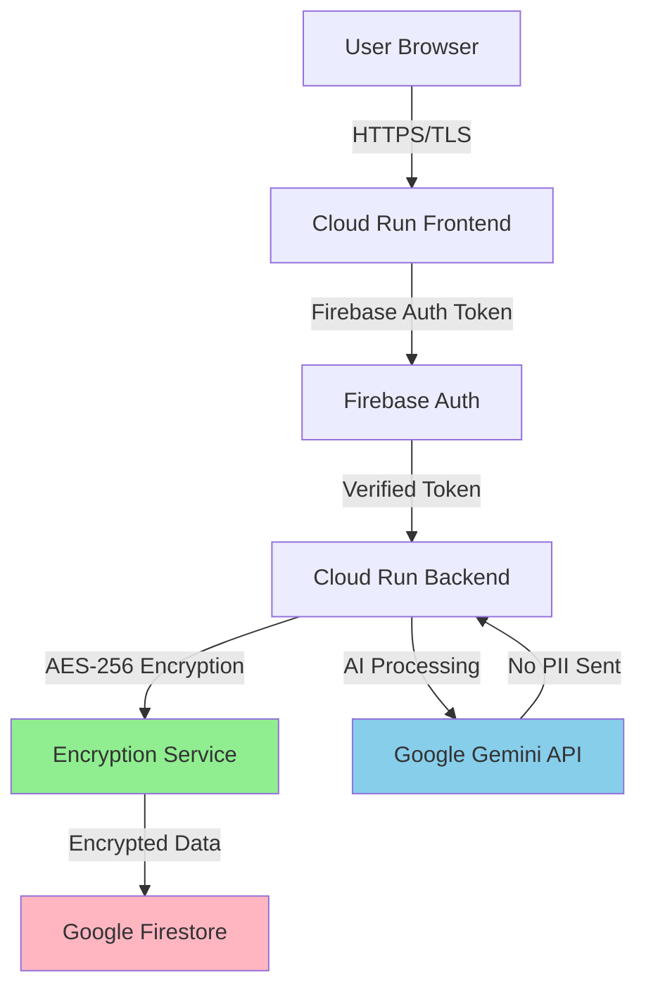

# AppSageAI Privacy Architecture

## Overview
AppSageAI implements comprehensive server-side encryption and privacy-first design principles to protect user data while providing powerful AI-driven resume analysis.

## Core Privacy Principles

### 🛡️ What I Protect
- **User Data**: All resumes, chat messages, and custom prompts are encrypted at rest
- **Personal Information**: Email addresses are hashed in analytics
- **Analysis Results**: AI-generated content encrypted before storage
- **User Identity**: No PII in logs, analytics use hashed identifiers

### 👁️ What I Can See
- **Authentication**: Email and display name for login purposes only
- **Metadata**: Timestamps, token counts, response times
- **Usage Analytics**: Anonymized usage patterns with hashed user IDs
- **System Health**: Error logs (sanitized), performance metrics

## Data Flow Architecture



## Encryption Implementation

### Server-Side AES-256 Encryption
```python
# All sensitive data encrypted before storage
class EncryptionService:
    def encrypt_content(self, data: bytes) -> str:
        """AES-256-GCM encryption using Fernet"""
        cipher = Fernet(self.key)
        return cipher.encrypt(data).decode()
    
    def decrypt_content(self, encrypted: str) -> bytes:
        """Secure decryption with authentication"""
        cipher = Fernet(self.key)
        return cipher.decrypt(encrypted.encode())
```

### What Gets Encrypted
- ✅ **Resume PDFs**: Full document content
- ✅ **Chat Messages**: User queries and AI responses
- ✅ **Custom Prompts**: User-defined templates
- ✅ **Job Descriptions**: Pasted job listings
- ✅ **Analysis Results**: All AI-generated content

### Encryption Key Management
```python
# Key Generation
from cryptography.fernet import Fernet
encryption_key = Fernet.generate_key()  # 256-bit key

# Key Rotation Strategy
- Keys stored in environment variables
- Rotated quarterly for production
- Unique per deployment environment
- Never committed to source control
```

## Firestore Data Structure

```
users/{userId}/                     
    # User Profile (Minimal Data)
    email: "user@example.com"       # Only data I can see
    name: "Display Name"            # From OAuth provider
    created_at: timestamp
    plan: "free"
    
    chats/{chatId}/
        # Encrypted Content
        job_title: "Software Engineer"  # Visible metadata
        company: "TechCorp"             # Visible metadata
        job_description: "ENCRYPTED"    # AES-256 encrypted
        
        messages/{messageId}/
            role: "user/assistant"
            encrypted_content: "U2FsdGVkX1+..."  # Encrypted
            timestamp: timestamp
            metadata: {
                tokens_used: 1500        # Visible for billing
                model: "gemini-2.5"      # Visible for debugging
            }
    
    resumes/{resumeId}/
        filename: "resume.pdf"          # Visible metadata
        encrypted_content: "..."        # AES-256 encrypted
        uploaded_at: timestamp
        target_role: "ENCRYPTED"        # Optional encryption
    
    custom_prompts/{promptType}/
        prompt_template: "ENCRYPTED"    # User's custom prompts
        updated_at: timestamp

analytics/{recordId}/
    user_id_hash: "sha256_hash"        # Hashed, not reversible
    action: "analysis_performed"
    timestamp: timestamp
    metrics: {...}                      # No PII
```

## Privacy Features

### No PII in AI Processing
```python
# Before sending to Gemini API
def prepare_for_ai(content):
    # Content is already from encrypted storage
    # No user identifiers sent to AI
    # No email addresses in prompts
    # No names unless user provides them
    return sanitized_content
```

### No PII in Logs
```python
class PrivacyFilter(logging.Filter):
    """Remove sensitive information from logs"""
    sensitive_patterns = [
        (r'\b[\w.+-]+@[\w.-]+\.[a-z]{2,}\b', '[EMAIL]'),
        (r'\b\d{3}-\d{2}-\d{4}\b', '[SSN]'),
        (r'\b\d{16}\b', '[CREDIT_CARD]'),
        (r'Bearer\s+[\w-]+', 'Bearer [TOKEN]')
    ]
    
    def filter(self, record):
        # Sanitize all log messages
        for pattern, replacement in self.sensitive_patterns:
            record.msg = re.sub(pattern, replacement, str(record.msg))
        return True
```

### Analytics Without Identity
```python
def log_analytics(user_id: str, action: str):
    # Hash user ID - one way, non-reversible
    user_hash = hashlib.sha256(user_id.encode()).hexdigest()[:16]
    
    analytics_data = {
        "user_id_hash": user_hash,  # Cannot reverse to get user_id
        "action": action,
        "timestamp": datetime.utcnow(),
        "metrics": get_metrics()     # Token counts, response times
    }
    # No PII stored in analytics
```

## GDPR Compliance

### ✅ Data Subject Rights
- **Right to Access**: Users can export all their data
- **Right to Erasure**: Complete account deletion available
- **Right to Portability**: Data export in standard formats
- **Right to Rectification**: Users can update their information

### ✅ Privacy by Design
- Minimal data collection (only what's necessary)
- Encryption by default for all sensitive data
- Purpose limitation (data used only for stated purposes)
- Data minimization in analytics

### ✅ Lawful Basis
- **Consent**: Explicit consent through terms acceptance
- **Legitimate Interest**: Service improvement through anonymized analytics
- **Contract**: Necessary for service provision

## Security Measures

### Infrastructure Security
- **HTTPS/TLS 1.3**: All data in transit encrypted
- **Cloud Run**: Managed, auto-patching infrastructure
- **Firebase Auth**: Industry-standard OAuth 2.0
- **Firestore Rules**: Row-level security

### Application Security
```javascript
// Firestore Security Rules
match /users/{userId}/{document=**} {
  // Users can only access their own data
  allow read, write: if request.auth != null 
    && request.auth.uid == userId;
}

match /analytics/{document=**} {
  // Analytics are write-only, no reads
  allow write: if request.auth != null;
  allow read: if false;
}
```

### Access Controls
- **Authentication Required**: All API endpoints protected
- **User Isolation**: Strict user data separation
- **Service Accounts**: Minimal permissions principle
- **No Backdoors**: No admin access to encrypted data

## Audit & Monitoring

### Access Logging
```json
{
  "timestamp": "2024-01-15T10:30:00Z",
  "user_hash": "a3f4b2c1...",  // Hashed user ID
  "action": "resume_upload",
  "resource": "resumes",
  "ip_hash": "b2c3d4e5...",    // Hashed IP
  "result": "success"
}
```

### Compliance Monitoring
- Regular security audits
- Encryption key rotation tracking
- Access pattern analysis
- Anomaly detection for suspicious activity

## Data Retention

### Active Data
- **User Data**: Retained while account active
- **Chat History**: No automatic deletion
- **Resumes**: User-controlled deletion

### Deleted Accounts
- **Immediate**: All user data marked for deletion
- **30 Days**: Grace period for recovery
- **Permanent**: Complete purge after grace period

## Emergency Procedures

### Data Breach Response
1. **Encrypted data remains protected** (AES-256)
2. **No decryption keys stored** with data
3. **User notification** within 72 hours (GDPR)
4. **Password reset** enforcement
5. **Key rotation** immediately

### Key Compromise
```bash
# Immediate key rotation procedure
1. Generate new encryption key
2. Deploy with new key
3. Re-encrypt existing data (migration script)
4. Revoke old key
5. Audit access logs
```

## Third-Party Data Sharing

### What I Share
- ❌ **Never**: User data, resumes, or messages
- ❌ **Never**: Personal information or emails
- ✅ **Only**: Anonymized, aggregated statistics

### AI Processing
- **Google Gemini**: Receives only content, no user identifiers
- **No Training**: Opt-out of AI model training
- **No Storage**: AI providers don't retain user content

## User Privacy Controls

### Available Controls
- ✅ Export all data
- ✅ Delete specific items
- ✅ Clear all history
- ✅ Delete entire account
- ✅ Opt-out of analytics

### Transparency
- Clear privacy policy
- Accessible data practices
- Regular transparency reports
- Open-source codebase for auditing

## Verification

### What You Can Verify
```bash
# Check what's actually stored in Firestore
# All sensitive fields show as encrypted blobs
{
  "encrypted_content": "gAAAAABh3K4N2AUq8..."  # Meaningless without key
  "timestamp": "2024-01-15T10:30:00Z"          # Metadata visible
}
```

### Privacy Guarantees
1. **I cannot read your encrypted data** without the encryption key
2. **No PII in our logs or analytics**
3. **Your data never used for AI training**
4. **Complete data deletion on account removal**
5. **GDPR compliant data handling**

---

**Your privacy is our foundation, not an afterthought.**