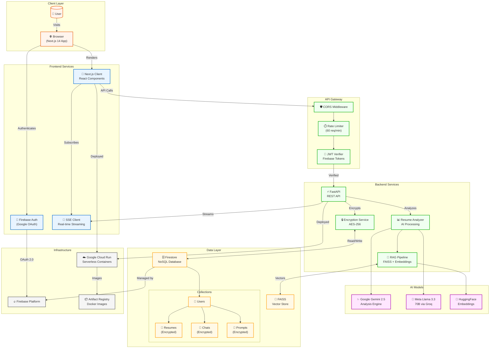
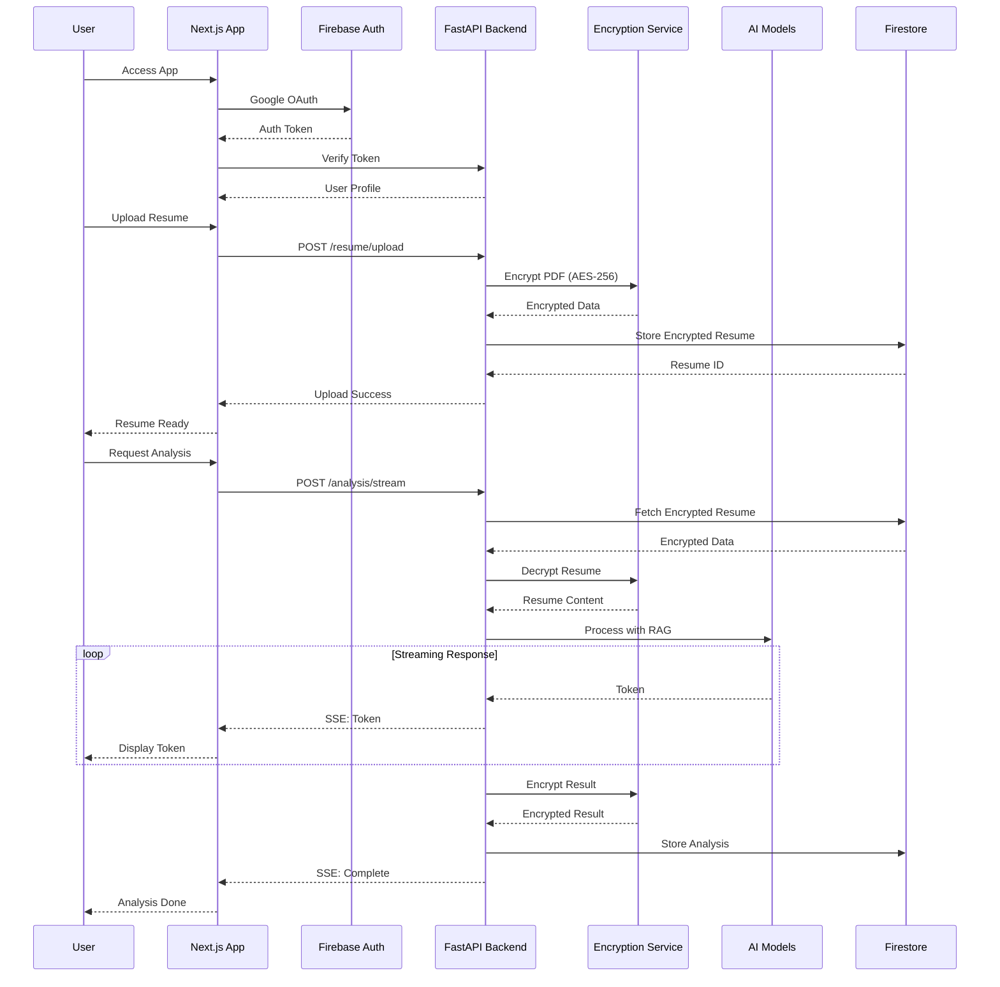

# AppSageAI Complete Setup Guide

Comprehensive setup instructions for deploying AppSageAI on Google Cloud Platform.

## Architecture

### System Architecture



### Sequence Diagram



## Prerequisites

### Required Accounts
- **Google Cloud Account** with billing enabled (free tier available)
- **GitHub Account** for source code and CI/CD
- **Domain Name** (optional, for custom domain)

### Required Tools
- **gcloud CLI** - Google Cloud command-line tool
- **Git** - Version control
- **Node.js 18+** - Frontend development
- **Python 3.11+** - Backend development
- **Docker** (optional) - Local containerization

## Google Cloud Platform Setup

### Step 1: Install Google Cloud SDK

#### macOS
```bash
# Using Homebrew
brew install --cask google-cloud-sdk

# Or download directly
curl https://sdk.cloud.google.com | bash
exec -l $SHELL
```

#### Linux/WSL
```bash
# Add Cloud SDK distribution URI as package source
echo "deb [signed-by=/usr/share/keyrings/cloud.google.gpg] https://packages.cloud.google.com/apt cloud-sdk main" | sudo tee -a /etc/apt/sources.list.d/google-cloud-sdk.list

# Import Google Cloud public key
curl https://packages.cloud.google.com/apt/doc/apt-key.gpg | sudo apt-key --keyring /usr/share/keyrings/cloud.google.gpg add -

# Update and install
sudo apt-get update && sudo apt-get install google-cloud-cli
```

#### Windows
```powershell
# Download installer from:
# https://cloud.google.com/sdk/docs/install#windows

# Or use PowerShell
(New-Object Net.WebClient).DownloadFile("https://dl.google.com/dl/cloudsdk/channels/rapid/GoogleCloudSDKInstaller.exe", "$env:Temp\GoogleCloudSDKInstaller.exe")
& $env:Temp\GoogleCloudSDKInstaller.exe
```

### Step 2: Initialize gcloud and Create Project

```bash
# Authenticate with Google Cloud
gcloud auth login

# Create new project (replace with your project ID)
gcloud projects create appsageai-[YOUR-UNIQUE-ID] --name="AppSageAI"

# Set as current project
gcloud config set project appsageai-[YOUR-UNIQUE-ID]

# Enable billing (required for services)
# Visit: https://console.cloud.google.com/billing
```

### Step 3: Enable Required APIs

#### Using gcloud CLI
```bash
# Enable all required APIs
gcloud services enable \
  run.googleapis.com \
  firestore.googleapis.com \
  firebase.googleapis.com \
  artifactregistry.googleapis.com \
  cloudbuild.googleapis.com \
  secretmanager.googleapis.com \
  iamcredentials.googleapis.com \
  aiplatform.googleapis.com
```

#### Using Google Cloud Console
1. Navigate to [APIs & Services](https://console.cloud.google.com/apis/library)
2. Enable each service:
   - Cloud Run API
   - Firestore API
   - Firebase Management API
   - Artifact Registry API
   - Cloud Build API
   - Secret Manager API
   - IAM Service Account Credentials API
   - Vertex AI API (for Gemini)

### Step 4: Set Up Firebase

#### Using Firebase Console
1. Go to [Firebase Console](https://console.firebase.google.com)
2. Click **Add Project**
3. Select your existing GCP project (`appsageai-[YOUR-UNIQUE-ID]`)
4. Confirm Firebase billing plan (Blaze plan for Cloud Run)
5. Continue through setup wizard

#### Enable Firebase Services
```bash
# Using Firebase CLI
npm install -g firebase-tools
firebase login
firebase init

# Select:
# - Firestore (for database)
# - Authentication
# - Hosting (optional)
```

### Step 5: Configure Firestore Database

#### Using gcloud CLI
```bash
# Create Firestore database
gcloud firestore databases create \
  --location=us-central1 \
  --type=firestore-native

# Set up security rules (create firestore.rules file)
cat > firestore.rules << 'EOF'
rules_version = '2';
service cloud.firestore {
  match /databases/{database}/documents {
    // Only authenticated users can read/write their own data
    match /users/{userId}/{document=**} {
      allow read, write: if request.auth != null && request.auth.uid == userId;
    }
    // Analytics can be written by authenticated users
    match /analytics/{document=**} {
      allow write: if request.auth != null;
    }
    // Feedback can be written by authenticated users
    match /feedback/{document=**} {
      allow read, write: if request.auth != null;
    }
  }
}
EOF

# Deploy rules
firebase deploy --only firestore:rules
```

#### Using Firebase Console
1. Navigate to **Firestore Database** → **Create Database**
2. Choose **Production mode**
3. Select location: `us-central1`
4. Database ID: Leave as `(default)` or use `appsageai`

### Step 6: Set Up Authentication

#### Enable Auth Providers
```bash
# This must be done in Firebase Console
# Navigate to Authentication → Sign-in method
```

1. Enable **Google** provider:
   - Click Google → Enable
   - Add project support email
   - Configure OAuth consent screen if prompted

2. Configure authorized domains:
   - Add `localhost` for development
   - Add your Cloud Run service URLs
   - Add custom domain if applicable

### Step 7: Create Service Account

#### Using gcloud CLI
```bash
# Create service account for backend
gcloud iam service-accounts create appsageai-backend \
  --display-name="AppSageAI Backend Service"

# Grant necessary permissions
gcloud projects add-iam-policy-binding appsageai-[YOUR-UNIQUE-ID] \
  --member="serviceAccount:appsageai-backend@appsageai-[YOUR-UNIQUE-ID].iam.gserviceaccount.com" \
  --role="roles/datastore.user"

gcloud projects add-iam-policy-binding appsageai-[YOUR-UNIQUE-ID] \
  --member="serviceAccount:appsageai-backend@appsageai-[YOUR-UNIQUE-ID].iam.gserviceaccount.com" \
  --role="roles/firebase.sdkAdminServiceAgent"

# Download service account key (for local development)
gcloud iam service-accounts keys create ./service-account.json \
  --iam-account=appsageai-backend@appsageai-[YOUR-UNIQUE-ID].iam.gserviceaccount.com
```

#### Using Google Cloud Console
1. Navigate to **IAM & Admin** → **Service Accounts**
2. Click **Create Service Account**
3. Name: `appsageai-backend`
4. Grant roles:
   - Cloud Datastore User
   - Firebase Admin SDK Service Agent
5. Create and download JSON key

### Step 8: Set Up Artifact Registry

```bash
# Create repository for Docker images
gcloud artifacts repositories create appsageai-backend \
  --repository-format=docker \
  --location=us-central1 \
  --description="Backend Docker images"

gcloud artifacts repositories create appsageai-frontend \
  --repository-format=docker \
  --location=us-central1 \
  --description="Frontend Docker images"

# Configure Docker authentication
gcloud auth configure-docker us-central1-docker.pkg.dev
```

### Step 9: Set Up Vertex AI (for Gemini)

```bash
# Enable Vertex AI
gcloud services enable aiplatform.googleapis.com

# Grant service account access to Vertex AI
gcloud projects add-iam-policy-binding appsageai-[YOUR-UNIQUE-ID] \
  --member="serviceAccount:appsageai-backend@appsageai-[YOUR-UNIQUE-ID].iam.gserviceaccount.com" \
  --role="roles/aiplatform.user"
```

### Step 10: Configure GitHub Actions

#### Create GitHub Secrets
Go to your repository → Settings → Secrets and variables → Actions

Add the following secrets:
- `GCP_SA_KEY` - Service account JSON key (entire content)
- `GCP_PROJECT_ID` - Your project ID
- `FIREBASE_API_KEY` - From Firebase Console
- `FIREBASE_AUTH_DOMAIN` - From Firebase Console
- `FIREBASE_MESSAGING_SENDER_ID` - From Firebase Console
- `FIREBASE_APP_ID` - From Firebase Console
- `FIREBASE_STORAGE_BUCKET` - From Firebase Console
- `JWT_SECRET_KEY` - Generate secure key
- `ENCRYPTION_KEY` - Generate with Fernet
- `BACKEND_URL` - Will be Cloud Run URL after first deploy
- `CORS_ORIGIN_2` - Your frontend URL
- `CORS_ORIGIN_3` - Additional origin (optional)
- `HF_TOKEN` - HuggingFace token (optional)

#### Enable GitHub Actions
```yaml
# Create .github/workflows/deploy-backend.yml
# Create .github/workflows/deploy-frontend.yml
# (Use the workflow files from your deployment setup)
```

### Step 11: Deploy to Cloud Run

#### Backend Deployment
```bash
# Build and deploy backend
gcloud run deploy appsageai-backend \
  --source ./backend \
  --port 8000 \
  --region us-central1 \
  --allow-unauthenticated \
  --service-account appsageai-backend@appsageai-[YOUR-UNIQUE-ID].iam.gserviceaccount.com \
  --memory 8Gi \
  --cpu 4 \
  --timeout 240 \
  --max-instances 10 \
  --set-env-vars="ENVIRONMENT=production,GCP_PROJECT_ID=appsageai-[YOUR-UNIQUE-ID]"
```

#### Frontend Deployment
```bash
# Build and deploy frontend
gcloud run deploy appsageai-frontend \
  --source ./frontend \
  --port 3000 \
  --region us-central1 \
  --allow-unauthenticated \
  --memory 2Gi \
  --cpu 4 \
  --timeout 60 \
  --max-instances 10
```

### Step 12: Configure Custom Domain (Optional)

```bash
# Map custom domain to Cloud Run service
gcloud run domain-mappings create \
  --service=appsageai-frontend \
  --domain=yourdomain.com \
  --region=us-central1

# Follow DNS configuration instructions provided
```

## Security Configuration

### Firestore Security Rules
```javascript
// firestore.rules
rules_version = '2';
service cloud.firestore {
  match /databases/{database}/documents {
    // Users can only access their own data
    match /users/{userId}/{document=**} {
      allow read, write: if request.auth != null 
        && request.auth.uid == userId;
    }
    
    // Analytics - write only
    match /analytics/{document=**} {
      allow write: if request.auth != null;
      allow read: if false;
    }
    
    // Feedback - authenticated users
    match /feedback/{document=**} {
      allow read, write: if request.auth != null;
    }
  }
}
```

### Cloud Run Service Configuration
```bash
# Set up Cloud Run service account permissions
gcloud run services update appsageai-backend \
  --service-account=appsageai-backend@appsageai-[YOUR-UNIQUE-ID].iam.gserviceaccount.com \
  --region=us-central1

# Configure CORS in backend environment
gcloud run services update appsageai-backend \
  --update-env-vars="CORS_ORIGIN_1=https://yourdomain.com" \
  --region=us-central1
```

## Deployment Verification

### Health Checks
```bash
# Backend health check
curl https://appsageai-backend-xxxxx-uc.a.run.app/health

# Frontend check
curl https://appsageai-frontend-xxxxx-uc.a.run.app

# Firestore connection test
gcloud firestore operations list
```

### Monitoring Setup
```bash
# Enable Cloud Monitoring
gcloud services enable monitoring.googleapis.com

# Create uptime checks
gcloud monitoring uptime-check-configs create \
  --display-name="Backend Health Check" \
  --resource-type="uptime-url" \
  --hostname="appsageai-backend-xxxxx-uc.a.run.app" \
  --path="/health"
```

## Cost Optimization

### Free Tier Usage
- **Cloud Run**: 2 million requests/month free
- **Firestore**: 1GB storage, 50K reads, 20K writes/day free
- **Firebase Auth**: 10K verifications/month free
- **Vertex AI**: $0.00025 per 1K characters for Gemini Flash

### Cost Monitoring
```bash
# Set up budget alerts
gcloud billing budgets create \
  --billing-account=YOUR_BILLING_ACCOUNT \
  --display-name="AppSageAI Monthly Budget" \
  --budget-amount=50 \
  --threshold-rule=percent=50 \
  --threshold-rule=percent=90 \
  --threshold-rule=percent=100
```

## Local Development Setup

For detailed local development setup:

- **Backend Setup**: See [backend/README.md](../backend/README.md)
- **Frontend Setup**: See [frontend/README.md](../frontend/README.md)

### Quick Local Start
```bash
# Backend (Terminal 1)
cd backend
source .venv/bin/activate
uvicorn app.main:app --reload

# Frontend (Terminal 2)
cd frontend
npm run dev

# Access at http://localhost:3000
```

## Troubleshooting

### Common Issues

**Authentication Errors**
```bash
# Re-authenticate gcloud
gcloud auth application-default login
gcloud auth login
```

**Deployment Failures**
```bash
# Check Cloud Build logs
gcloud builds list --limit=5
gcloud builds log [BUILD_ID]
```

**Firestore Connection Issues**
```bash
# Verify service account permissions
gcloud projects get-iam-policy appsageai-[YOUR-UNIQUE-ID]
```

**CORS Errors**
```bash
# Update Cloud Run environment variables
gcloud run services update appsageai-backend \
  --update-env-vars="CORS_ORIGIN_1=http://localhost:3000" \
  --region=us-central1
```

## 🔗 Related Documentation

- [Google Cloud Run Documentation](https://cloud.google.com/run/docs)
- [Firebase Documentation](https://firebase.google.com/docs)
- [Vertex AI Gemini Documentation](https://cloud.google.com/vertex-ai/docs/generative-ai/model-reference/gemini)
- [GitHub Actions Documentation](https://docs.github.com/en/actions)

## 📧 Support

For deployment issues:
1. Check [Cloud Run logs](https://console.cloud.google.com/run)
2. Review [Firebase Console](https://console.firebase.google.com)
3. Create an issue on GitHub with error details

---

**Ready to deploy your privacy-first resume analysis platform!**