# AppSageAI User Guide

Your privacy-first AI companion for landing your dream job. This guide will walk you through every feature of AppSageAI, showing you how to maximize your job search success while keeping your data completely secure.

## Getting Started

### Landing Page & Sign In

When you first visit AppSageAI, you're greeted with a clean, modern landing page featuring our signature orange accent colors. Here you can:

- **Watch Demo** - See the platform in action before signing up
- **Sign in with Google** - One-click authentication using your Google account
- **Learn about our privacy commitment** - Your data is encrypted with AES-256, ensuring even we cannot access your personal information

Simply click the pulsing "Sign in with Google" button to get started. No credit card, no trials, no paywalls - completely free forever.

## 🏠 Your Dashboard

After signing in, you'll land on your personalized dashboard where you're greeted by name. The dashboard shows:

- **Active Chats** - Number of ongoing job application conversations
- **Applications** - Chats you've tagged as actual job applications you're tracking
- **This Week** - Your recent activity to keep momentum going

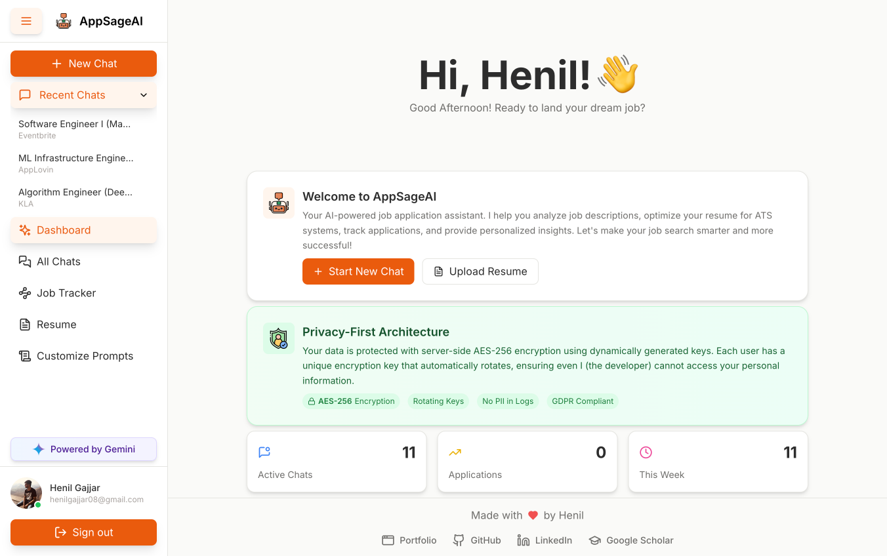

The dashboard features beautiful animations and a collapsible sidebar (try clicking the menu button in the top-left to see the smooth transitions!).

## Step 1: Upload Your Resume

Your first step is uploading your resume - the foundation of all your analyses.

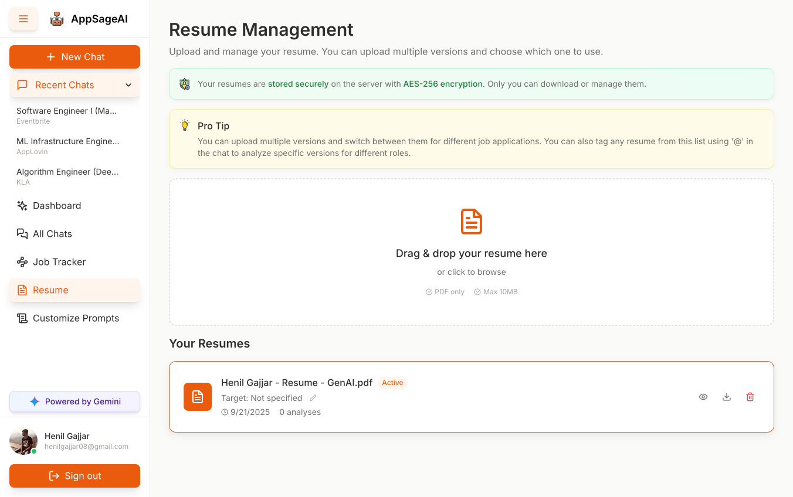

1. Navigate to **Resume** in the sidebar or click "Upload Resume" on the dashboard
2. Drag and drop your PDF resume or click to browse
3. **Optional**: Add a target role (e.g., "Senior Software Engineer") to help organize multiple resume versions
4. Your resume is instantly encrypted with AES-256 encryption

**Pro Tip**: You can upload multiple resume versions for different roles. Set one as "Active" for default use, or use the @ symbol in chats to reference specific versions.

## Step 2: Start Your First Chat

Now for the magic - analyzing job opportunities!

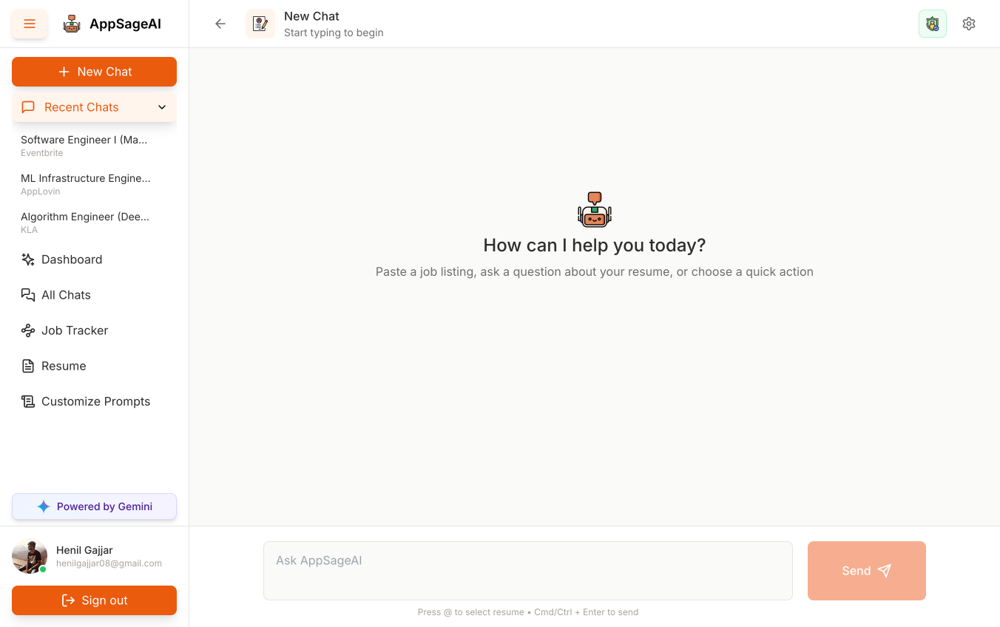

1. Click **"New Chat"** (the orange button in the sidebar)
2. Copy any job description from LinkedIn, Indeed, or any job board
3. Paste it directly into the chat input field

AppSageAI automatically:
- Detects the job title
- Identifies the company name
- Extracts the full job description
- Creates a dedicated chat session for this opportunity

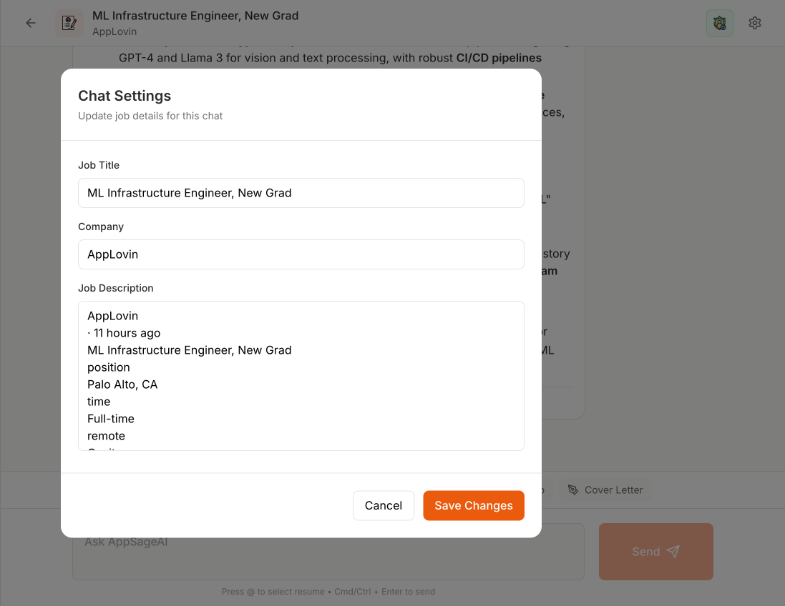

## 🎯 Quick Actions - Your AI Toolkit

Once you've pasted a job description, you have 5 powerful quick action buttons:

#### **Job Match Analysis**
Comprehensive review comparing your resume against job requirements, highlighting strengths and gaps.

#### **ATS Scan**
Analyzes keyword optimization to ensure your resume passes Applicant Tracking Systems.

#### **Match Score**
Calculates a percentage match with detailed breakdown of how well you fit the role.

#### **Skill Roadmap**
Identifies skill gaps and provides a personalized improvement plan with resources.

#### **Cover Letter**
Generates a tailored cover letter based on your resume and the specific job requirements.

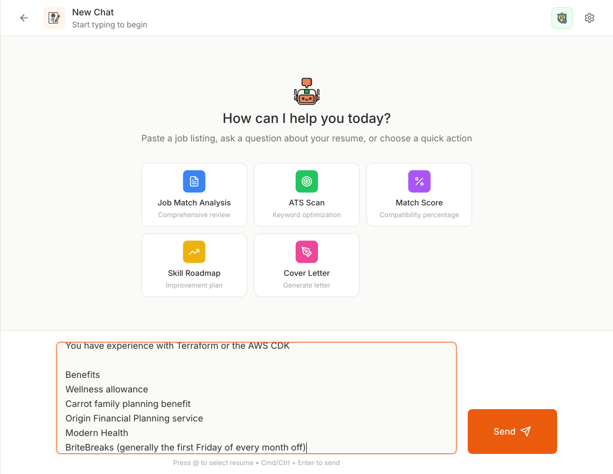

Simply click any button to run that analysis instantly!

## Advanced Chat Features

#### Custom Questions
Beyond quick actions, you can ask anything:
- "What are the 3 most important requirements for this role?"
- "How should I prepare for an interview here?"
- "What similar companies should I apply to?"

#### Resume Tagging with @
Type "@" in the chat to see all your uploaded resumes. Select one to analyze a specific version for that particular role. 

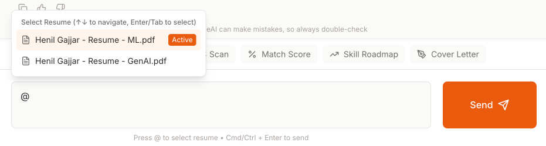

**Note**: Only tag one resume at a time - the system is optimized for single resume analysis.

#### Real-time Streaming
Watch as AppSageAI thinks! Responses stream in real-time with a glowing logo animation, making the experience feel alive and responsive.

#### Feedback System
Use the thumbs up/down buttons on any AI response to help improve the system. Your feedback is stored securely and helps refine future responses.

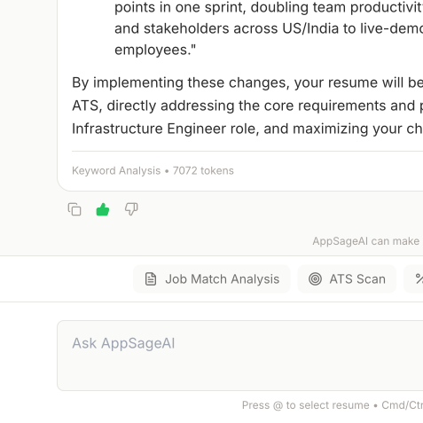

## Manage Your Chats

### Recent Chats Sidebar
The collapsible "Recent Chats" section in the sidebar shows your last 10 conversations for quick access.

### All Chats Page
Click "All Chats" to see your complete history where you can:
- **Search** by job title or company
- **Filter** by date or status
- **Navigate** to any previous conversation
- **Delete** chats you no longer need
- **Edit** job details using the settings icon

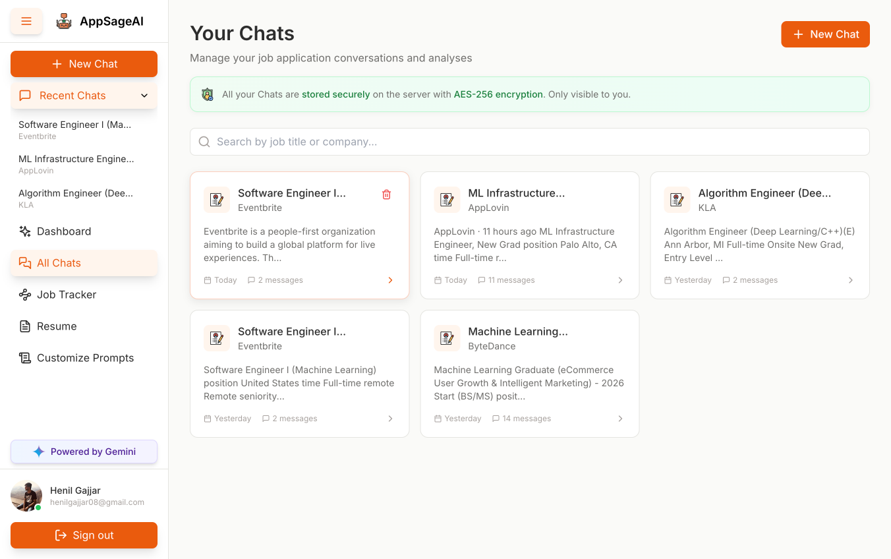

Each chat preserves:
- Your resume version used
- Complete conversation history
- Job description and details
- All analyses performed

## Job Tracker

Transform your chats into an organized job application pipeline!

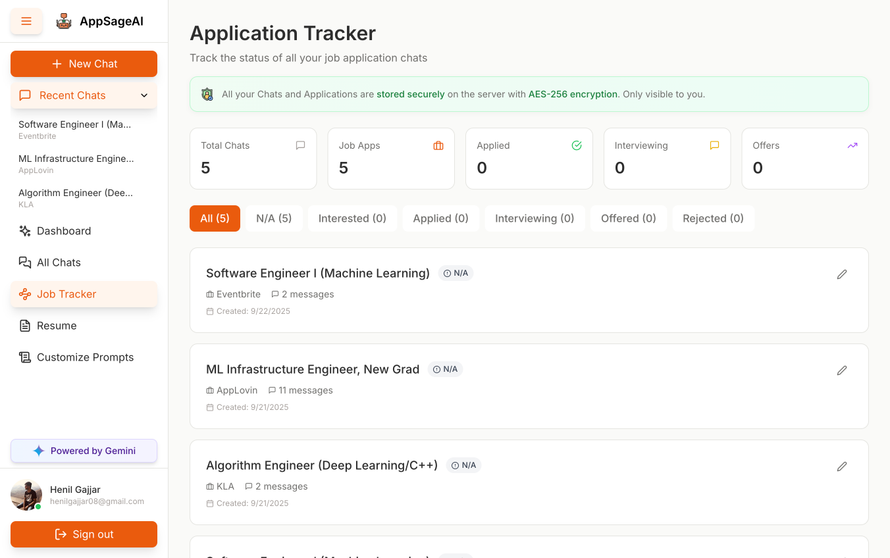

Navigate to **Job Tracker** to see all your opportunities in one place:

### Status Tags
- **N/A** - General career chats not tied to specific applications
- **Interested** - Roles you're considering
- **Applied** - Applications submitted
- **Interviewing** - Active interview processes
- **Offered** - Congratulations! 🎉
- **Rejected** - Learning opportunities

### Tracking Features
- Add application dates
- Write notes for each opportunity
- Filter by status
- See statistics dashboard
- Track your progress over time

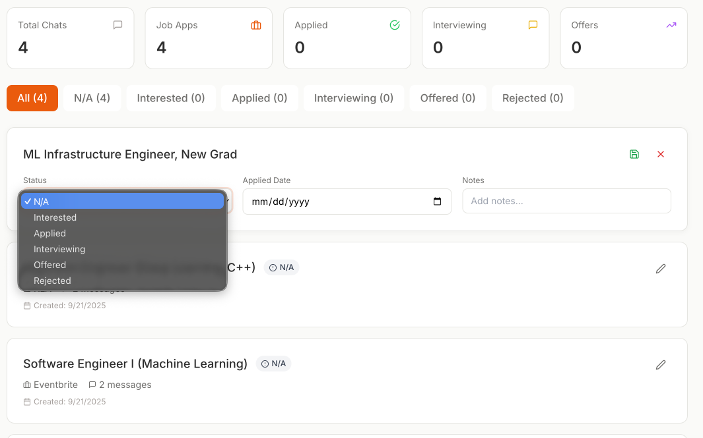

Click the edit icon on any chat to update its status and keep your job search organized.

## Customize Your AI Prompts

One of AppSageAI's most powerful features - make the AI work exactly how you want!

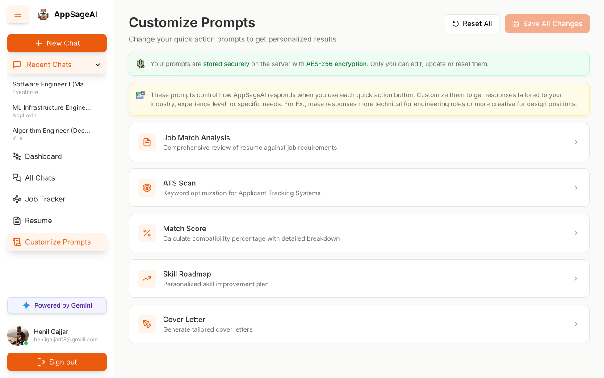

Navigate to **Customize Prompts** to personalize each quick action:

1. **View current prompts** - See exactly what instructions the AI follows
2. **Edit any prompt** - Tailor responses to your industry or preference
3. **Use variables** - Include `{context}`, `{user_name}`, `{job_description}` for dynamic content
4. **Save changes** - Your custom prompts are encrypted and stored securely
5. **Reset to defaults** - One click to restore original prompts

### Example Customizations
- Make responses more technical for engineering roles
- Add creativity for design positions
- Include industry-specific terminology
- Adjust tone from formal to conversational
- Add specific frameworks or methodologies you use

## 🔒 Privacy & Security Features

Every single interaction is protected:

### What's Encrypted
- ✅ All resumes (AES-256 encryption)
- ✅ Every chat message
- ✅ Job descriptions
- ✅ Custom prompts
- ✅ Personal notes

### What We Can't See
- 🔒 Your resume content
- 🔒 Your conversations
- 🔒 Your job search details
- 🔒 Any personal information

The green shield icon throughout the app reminds you that your privacy is always protected.

## ⚡ Pro Tips for Success

1. **Upload multiple resumes** - Keep versions for different role types
2. **Use the @ feature** - Tag specific resumes for targeted analysis
3. **Customize prompts** - Make the AI speak your industry's language
4. **Track everything** - Use the job tracker to never miss a follow-up
5. **Ask follow-ups** - The AI remembers context within each chat
6. **Use keyboard shortcuts** - Cmd/Ctrl + Enter to send messages

## Experience the Interface

As you use AppSageAI, notice the thoughtful details:
- Smooth animations when opening/closing the sidebar
- Gentle hover effects on all interactive elements
- Clean typography inspired by Claude's design
- Responsive layout that works on any device
- Loading states that feel natural, not frustrating

## Your Job Search Workflow

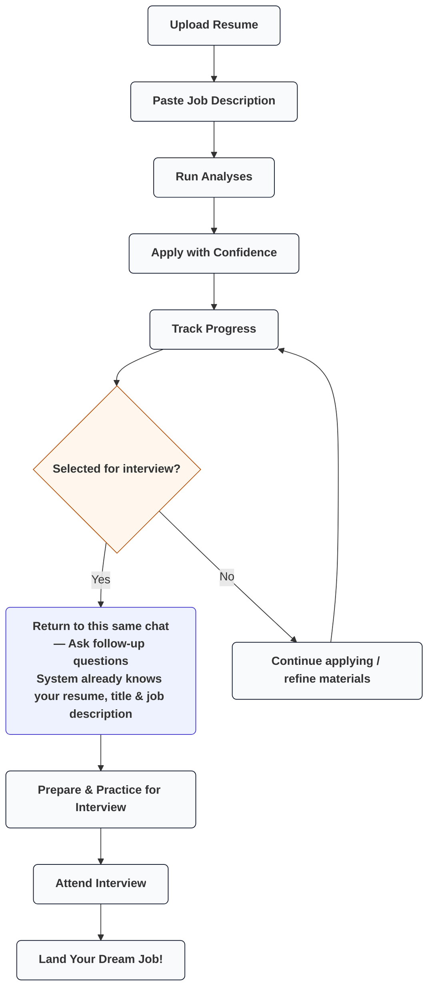

## 💬 Need Help?

- Each page has contextual tips and information boxes
- The interface guides you naturally through each process
- Error messages are friendly and helpful
- Your data is always safe, always private, always yours